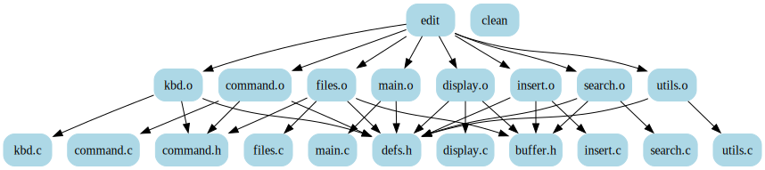
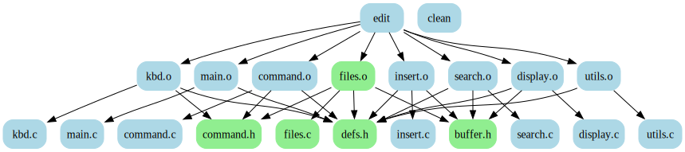
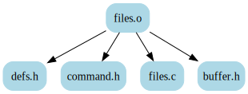

# makefile-graph

[](https://github.com/dnaeon/makefile-graph/actions/workflows/test.yaml/badge.svg)
[](https://pkg.go.dev/github.com/dnaeon/makefile-graph)
[](https://goreportcard.com/report/github.com/dnaeon/makefile-graph)
[](https://codecov.io/gh/dnaeon/makefile-graph)

`makefile-graph` is a Go module and CLI application, which parses
[GNU Make](https://www.gnu.org/software/make/)'s internal database and generates a
graph representing the relationships between the discovered Makefile targets.

## Requirements

* [GNU Make](https://www.gnu.org/software/make/)
* Go version 1.21.x or later

## Installation

You can install the CLI application using one of the following ways.

If you have cloned the repository you can build the CLI app using the provided
Makefile target.

``` shell
make build
```

The resulting binary will be located in `bin/makefile-graph`.

Install the CLI application using `go build`.

``` shell
go build -o $(go env GOBIN)/makefile-graph github.com/dnaeon/makefile-graph/cmd
```

In order to install the parser package and use it in your own Go code run the
following command within your Go module.

``` shell
go get -v github.com/dnaeon/makefile-graph/pkg/parser
```

## Usage

Let's use the following [example
Makefile](https://www.gnu.org/software/make/manual/html_node/Simple-Makefile.html)
from [GNU make's documentation](https://www.gnu.org/software/make/manual/make.html).

``` makefile
edit : main.o kbd.o command.o display.o \
       insert.o search.o files.o utils.o
	cc -o edit main.o kbd.o command.o display.o \
		   insert.o search.o files.o utils.o

main.o : main.c defs.h
	cc -c main.c
kbd.o : kbd.c defs.h command.h
	cc -c kbd.c
command.o : command.c defs.h command.h
	cc -c command.c
display.o : display.c defs.h buffer.h
	cc -c display.c
insert.o : insert.c defs.h buffer.h
	cc -c insert.c
search.o : search.c defs.h buffer.h
	cc -c search.c
files.o : files.c defs.h buffer.h command.h
	cc -c files.c
utils.o : utils.c defs.h
	cc -c utils.c
clean :
	rm edit main.o kbd.o command.o display.o \
	   insert.o search.o files.o utils.o
```

You can also find this example Makefile in the [examples](./examples/) directory
of this repo.

Running the following command will generate the [Dot
representation](https://graphviz.org/doc/info/lang.html) for the Makefile
targets and their dependencies from our example Makefile.

``` shell
makefile-graph --makefile examples/Makefile --direction TB
```

In order to render the graph you can pipe it directly to the
[dot command](https://graphviz.org/doc/info/command.html), e.g.

``` makefile
makefile-graph --makefile examples/Makefile --direction TB | dot -Tsvg -o graph.svg
```

This is what the graph looks like when we render it using `dot(1)`.



Sometimes when rendering large graphs it may not be obvious at first glance what
are the dependencies for a specific target. In order to help with such
situations `makefile-graph` supports a flag which allows you to highlight
specific targets and their dependencies.

The following command will highlight the `files.o` target along with it's
dependencies.

``` makefile
makefile-graph \
    --makefile examples/Makefile \
    --direction TB \
    --target files.o \
    --highlight \
    --highlight-color lightgreen
```

When we render the output from above command we will see this graph
representation.



If we want to focus on a specific target and it's dependencies only we can use
the following command, which will generate a graph only for the target and it's
dependencies.

``` makefile
makefile-graph \
    --makefile examples/Makefile \
    --direction TB \
    --target files.o \
    --related-only
```

This is what the resulting graph looks like.



The `--direction` option is used for specifying the [direction of graph
layout](https://graphviz.org/docs/attrs/rankdir/). You can set it to `TB`, `BT`,
`LR` or `RL`.

The `--format` option is used for specifying the output format for the graph. By
default it will produce the `dot` representation for the graph.

You can also view the [topological
order](https://en.wikipedia.org/wiki/Topological_sorting) for a given target by
setting the format to `tsort`, e.g.

``` makefile
makefile-graph \
    --makefile examples/Makefile \
    --target files.o \
    --related-only \
    --format tsort
```

Running above command produces the following output, which represents the
topological order for the `files.o` target.

``` text
defs.h
buffer.h
command.h
files.c
files.o
```

## Tests

Run the tests.

``` shell
make test
```

Run test coverage.

``` shell
make test-cover
```

## Contributing

`makefile-graph` is hosted on
[Github](https://pkg.go.dev/github.com/dnaeon/makefile-graph). Please contribute
by reporting issues, suggesting features or by sending patches using pull
requests.

## License

`makefile-graph` is Open Source and licensed under the [BSD
License](http://opensource.org/licenses/BSD-2-Clause).
